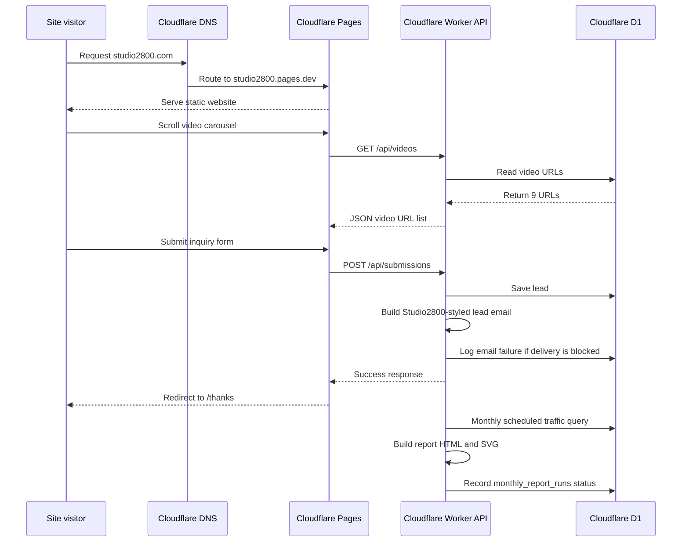

# Studio2800 Cloudflare Site Setup

Last updated: 2026-08-18

## Current Hosting Decision

Cloudflare is the main production hosting platform for Studio2800.

Netlify is retired from the production workflow and should not be used for normal deploys, DNS, or launch decisions.

## Agent Overlord Oversight

Agent Overlord is the Studio2800 oversight skill used to consolidate project status across the public website, Cloudflare Worker/API, AIVN/studio2800news, the private Studio Central platform, NVIDIA/business collateral, documentation, automations, and Boss Agent status work.

- Skill location: `/Users/jasondanyliw/.codex/skills/agent-overlord/`
- Project map: `/Users/jasondanyliw/.codex/skills/agent-overlord/references/studio2800-project-map.md`
- Automation name: `Agent Overlord Studio2800 Daily Oversight`
- Schedule: daily at 10:00 AM America/Detroit
- Delivery: authenticated Gmail account using `to: me`
- Reporting rule: summarize live status, risks, next actions, approval/login needs, and documentation updates without exposing passwords, API keys, OAuth tokens, cookies, or recovery codes.
- Boss Agent coordination: check Boss/status workspaces as context, then produce one consolidated Studio2800 project plan.

## Operational Verification

Last operational cleanup: 2026-08-18.

- `https://studio2800.com/`, `https://www.studio2800.com/`, and `https://studio2800.com/services/` returned HTTP 200 over HTTPS.
- DNS nameservers resolve to `matias.ns.cloudflare.com` and `lilith.ns.cloudflare.com`; `www.studio2800.com` resolves to `studio2800.pages.dev`.
- `https://studio2800-api.jason-danyliw.workers.dev/api/health` returned HTTP 200 with `ok:true`.
- `https://studio2800.com/feed.xml`, `https://studio2800.com/sitemap.xml`, and `https://studio2800.com/robots.txt` returned HTTP 200.
- Anonymous `https://demo.studio2800.com/` access redirected to Cloudflare Access login.
- Unauthenticated protected API calls returned HTTP 401 for `/api/admin/submissions`, `/api/admin/metrics`, `/api/admin/network-dashboard`, `/api/admin/monthly-report`, and `PUT /api/videos`.
- `GET /api/videos` returned nine current YouTube URLs, all set to `https://youtu.be/E18RGsfK7-Y`.
- Public `/api/site-settings` returned `livestreamEnabled:false`, so the Livestream link remains hidden unless enabled in Admin.
- The public form default option `Studio Central design-partner pilot` is now accepted by the Worker. A post-fix `/api/submissions` test returned HTTP 201 with lead email status `sent`.
- Current Worker version from this cleanup: `b56f8fb2-84da-4459-beb7-960e53d801b9`.
- Rollback marker for this cleanup: `rollback-markers/20260818-operational-cleanup-pre-worker-fix/`.

## GitHub Backup Status

Current status as of 2026-08-18: the active website workspace `/Users/jasondanyliw/Documents/Codex/2026-06-15/build-a-website` is not itself a Git repository. The canonical GitHub-ready backup package is `/Users/jasondanyliw/Documents/Codex/2026-06-26/c/outputs/github-ready/studio2800.com`, with remote `git@github.com:s2800-GH/studio2800.com.git`. It was refreshed with the current Cloudflare production `outputs/`, `cloudflare-api/`, and operational docs, then pushed to `main` at commit `7c4032f` (`Refresh Cloudflare production backup`). Netlify remains preserved only under the repo's `beta-archive/` history and should not be used for normal production work.

## Flowchart

```mermaid
flowchart TD
  A[Visitor opens studio2800.com] --> B[Cloudflare DNS]
  B --> C[studio2800.com CNAME to studio2800.pages.dev]
  B --> D[www.studio2800.com CNAME to studio2800.pages.dev]
  C --> E[Cloudflare Pages project: studio2800]
  D --> E
  E --> F[Static site files in outputs/]
  F --> G[Home page and video carousel]
  F --> H[Admin page /admin]
  F --> I[Metrics page /admin/metrics]
  F --> J[Thanks page /thanks]
  F --> K[RSS /feed.xml]

  G --> L[Cloudflare Worker API: studio2800-api]
  H --> L
  I --> L
  X[Cloudflare Cron Trigger] --> L
  L --> M[D1 database: studio2800-leads]
  M --> N[Form submissions]
  M --> O[9 video URLs]
  M --> P[Page views and metrics]
  M --> Q[Users and auth data]
  M --> R[Site error logs]
  M --> AA[Weekly report run history]
  L --> Y[Resend Free preferred]
  L --> AE[Cloudflare Email Service fallback]
  Y --> Z[Weekly traffic report email]
  Y --> AB[Lead notification email]
  L --> AC[Twilio SMS primary alert]
  L --> AD[Pushover app push fallback]

  S[Cloudflare Email Routing] --> T[studio@studio2800.com]
  S --> U[jdanyliw@studio2800.com]
  T --> AF[Forward to studio2800 Gmail]
  U --> AF

  V[Local development files] --> F
  V --> W[deploy-production.sh]
  W --> E
```

## Process Diagram



## Production Links

- Main site: https://studio2800.com/
- WWW site: https://www.studio2800.com/
- Cloudflare Pages preview: https://studio2800.pages.dev/
- Admin tools: https://studio2800.com/admin
- Metrics dashboard: https://studio2800.com/admin/metrics/
- Thanks page: https://studio2800.com/thanks
- RSS feed: https://studio2800.com/feed.xml
- Sitemap: https://studio2800.com/sitemap.xml
- Robots: https://studio2800.com/robots.txt
- API health: https://studio2800-api.jason-danyliw.workers.dev/api/health
- API videos: https://studio2800-api.jason-danyliw.workers.dev/api/videos
- Weekly report API, protected: https://studio2800-api.jason-danyliw.workers.dev/api/admin/monthly-report
- Lead email test API, protected: https://studio2800-api.jason-danyliw.workers.dev/api/admin/test-lead-email

## Cloudflare Resources

- Cloudflare account ID: `bd02c969c7d0831d3bb239ffdefe0fdb`
- DNS zone: `studio2800.com`
- Zone ID: `2a5c8eda6234e6738907b112980f71a7`
- Cloudflare Email Routing status: enabled
- Pages project: `studio2800`
- Pages project ID: `5f80fc54-1c13-4a25-804f-f76ccb72418c`
- Worker API: `studio2800-api`
- Worker API URL: `https://studio2800-api.jason-danyliw.workers.dev`
- D1 database: `studio2800-leads`
- D1 database ID: `917320e2-6309-4bad-b732-1d5d96fb3b40`
- Worker Email Service binding: `EMAIL`
- Email provider flag: `EMAIL_PROVIDER=resend`
- Email use: weekly traffic reports and lead notification emails through Resend when `RESEND_API_KEY` is present
- Weekly report schedule: hourly cron, sends once per week on Monday at or after 9 AM America/Detroit

## Service Inventory And Cost Notes

| Service | Current role | Cost status | Notes |
| --- | --- | --- | --- |
| Cloudflare Pages | Main production website host | Free tier active | Hosts `studio2800.com` static files. |
| Cloudflare Workers | API, admin, metrics, forms, weekly report logic | Free tier active | Native Email Sending to arbitrary recipients requires Workers Paid. |
| Cloudflare D1 | Form submissions, videos, metrics, site settings | Free tier active | Watch daily write/read limits as traffic grows. |
| Cloudflare DNS | Domain routing and DNS records | Free tier active | Main DNS manager for `studio2800.com`. |
| Cloudflare Email Routing | Free inbound forwarding for business-looking addresses | Free tier active | Routes `studio@studio2800.com` and `jdanyliw@studio2800.com` to the verified Studio2800 Gmail inbox. |
| GoDaddy | Domain registrar | Paid externally | Registrar only for this setup. Root GoDaddy MX records were removed on 2026-08-14. |
| GitHub | Source backup and rollback history | Free unless upgraded | Store approved production-ready versions and archives. |
| Resend | Transactional email provider | Free plan active | Account `jason.danyliw@gmail.com`; verified domain `studio2800.com`; Worker secret `RESEND_API_KEY` is set. |
| Twilio SMS | Optional text-message notifications | Partially configured | Worker has `SMS_ENABLED=true`; `TWILIO_ACCOUNT_SID` and `TWILIO_AUTH_TOKEN` are set, but Twilio sender/destination phone secrets are still missing. |
| Pushover | Optional app push fallback notifications | Feature flag enabled; provider not configured | Worker push fallback code is deployed. Used when Twilio SMS is disabled, blocked, or fails. Requires app token and user key secrets. |
| Google Ads / AdSense | Future traffic/monetization | Not active for Studio2800 | Confirm publisher ID and domain approval before adding ad code. |
| YouTube | Video hosting and showcase content | Free unless upgraded | Provides showcase video URLs and social links. |

Resend Free tradeoff:

- Cost: $0/month.
- Included usage: 3,000 emails/month and 100 emails/day.
- Requires a Resend account, one verified sending domain, DNS records for SPF/DKIM, and Worker secret `RESEND_API_KEY`.
- Current account: `jason.danyliw@gmail.com`.
- Current sending domain: `studio2800.com`.
- DNS records added in Cloudflare on 2026-07-17: `resend._domainkey` TXT for DKIM, `send` TXT for SPF, `send` MX for Amazon SES feedback, and `_dmarc` TXT with `p=none`.
- Public DNS confirms the added records. Resend domain status is `Verified` and ready to send emails.
- API key `studio2800-production` was created on 2026-07-18 with sending access scoped to `studio2800.com` and stored as Worker secret `RESEND_API_KEY`.
- Live protected test send through `/api/admin/test-lead-email` returned `ok: true` and `Lead notification email sent through resend`.
- Good fit for low-volume lead notifications and weekly reports.
- If the daily or monthly limits are exceeded, delivery will pause or require a paid Resend plan.

Cloudflare Email Sending tradeoff:

- Requires Workers Paid for arbitrary outbound recipients.
- Workers Paid starts at $5/month.
- Cloudflare Email Service includes 3,000 outbound emails/month on Workers Paid, then usage-based overage.
- Simplest long-term path if keeping email, Worker, Pages, DNS, and metrics inside Cloudflare matters more than minimizing monthly cost.

SMS/text notification setup:

- Current status: optional SMS code is deployed to `studio2800-api` with `SMS_ENABLED=true`. Cloudflare Worker secrets `TWILIO_ACCOUNT_SID` and `TWILIO_AUTH_TOKEN` are set. Actual sending is still blocked until `TWILIO_FROM_NUMBER` and `SMS_TO_NUMBER` are configured.
- Setup blocker found on 2026-07-18: Twilio phone-number management redirected to the trial-account upgrade page, so a sender number could not be confirmed from the console.
- Provider path: Twilio-compatible API.
- SMS use: contact form lead text alerts and short weekly traffic report summary texts.
- Admin test path: `/api/admin/test-lead-sms`, surfaced as `Send test text` on the private Admin page.
- Admin status path: `/api/admin/notification-status`, surfaced as `SMS and app backup` on the private Admin page.
- Failure handling: SMS failure is logged to D1 `site_errors` and does not block visitor form submissions or weekly report emails.
- Required Worker variables/secrets before enabling:
  - Worker variable `SMS_PROVIDER=twilio`
  - Worker variable `SMS_ENABLED=true`
  - Worker secret `TWILIO_ACCOUNT_SID`
  - Worker secret `TWILIO_AUTH_TOKEN`
  - Worker secret `TWILIO_FROM_NUMBER`
  - Worker secret `SMS_TO_NUMBER`
- Secure setup helper: run `tools/set-studio2800-sms-secrets.sh` locally and paste values only into the Wrangler prompts.
- Tradeoff: text messaging generally requires a paid SMS provider, sender number setup, and carrier compliance steps. The Worker flag is on, but texts cannot send until the sender number and destination phone are confirmed.

App push fallback setup:

- Current status: optional Pushover-compatible app push code is deployed to `studio2800-api`. Actual delivery is blocked until Pushover secrets are configured.
- Provider path: Pushover API.
- Push use: backup lead alerts and weekly traffic report summary alerts when Twilio SMS does not send.
- Admin test path: `/api/admin/test-lead-push`, surfaced as `Send test push` on the private Admin page.
- Failover test path: `/api/admin/test-notification-failover`, surfaced as `Test failover` on the private Admin page. It simulates a Twilio failure and sends the app push backup if Pushover is configured.
- Failure handling: push failure is logged to D1 `site_errors` and does not block visitor form submissions, lead emails, report emails, or Twilio attempts.
- Twilio expiration behavior: if Twilio expires, loses sender eligibility, or returns an API error, lead/report email still sends through Resend. The Worker then attempts the Pushover app push backup when `PUSH_ON_SMS_FAILURE=true` and Pushover secrets are configured.
- Required Worker variables/secrets before enabling:
  - Worker variable `PUSH_PROVIDER=pushover`
  - Worker variable `PUSH_ENABLED=true`
  - Worker variable `PUSH_ON_SMS_FAILURE=true`
  - Worker secret `PUSHOVER_APP_TOKEN`
  - Worker secret `PUSHOVER_USER_KEY`
- Secure setup helper: run `tools/set-studio2800-push-secrets.sh` locally and paste values only into the Wrangler prompts.
- Tradeoff: app push is not a carrier SMS text. It requires the Pushover phone app, but avoids SMS carrier registration and recurring carrier message fees.

## DNS Records

Web records:

- `studio2800.com` CNAME -> `studio2800.pages.dev`
- `www.studio2800.com` CNAME -> `studio2800.pages.dev`

Mail routing current state:

- Cloudflare Email Routing is enabled for `studio2800.com`.
- `studio@studio2800.com` forwards to the verified Studio2800 Gmail destination.
- `jdanyliw@studio2800.com` forwards to the verified Studio2800 Gmail destination.
- `studio2800.com` MX priority `7` -> `route1.mx.cloudflare.net`
- `studio2800.com` MX priority `17` -> `route2.mx.cloudflare.net`
- `studio2800.com` MX priority `96` -> `route3.mx.cloudflare.net`
- `cf2024-1._domainkey.studio2800.com` TXT -> Cloudflare Email Routing DKIM value
- `studio2800.com` TXT -> `v=spf1 include:_spf.mx.cloudflare.net ~all`
- `send.studio2800.com` MX -> `feedback-smtp.us-east-1.amazonses.com` remains in place for Resend bounce/feedback handling.

Mail routing note:

- This is free inbound email forwarding, not a full paid mailbox.
- Incoming mail to the two Studio2800 domain addresses arrives in the Studio2800 Gmail inbox and can be monitored from the Mac Mail app if that Gmail account is added there.
- Sending mail so replies show `studio@studio2800.com` or `jdanyliw@studio2800.com` requires a separate Gmail "Send mail as" setup or a paid mailbox/provider later.

Mail rollback records:

- If Cloudflare Email Routing must be undone, remove the Cloudflare root MX records and restore the old GoDaddy root MX records:
  - `studio2800.com` MX priority `0` -> `smtp.secureserver.net`
  - `studio2800.com` MX priority `10` -> `mailstore1.secureserver.net`
- Keep the Resend `send.studio2800.com` MX record unless intentionally disabling Resend transactional email.

## Admin And Metrics Credentials

Admin and metrics use the same password gate.

- Login page: https://studio2800.com/admin
- Metrics page: https://studio2800.com/admin/metrics/
- Password source: Cloudflare Worker secret `ADMIN_PASSWORD`
- Auth signing secret: Cloudflare Worker secret `AUTH_SECRET`
- Weekly report recipient: Cloudflare Worker secret `REPORT_TO_EMAIL`
- Weekly report sender: Cloudflare Worker secret `REPORT_FROM_EMAIL`
- Lead notification recipient: optional Cloudflare Worker secret `LEAD_TO_EMAIL`; falls back to `REPORT_TO_EMAIL`
- Lead notification sender: optional Cloudflare Worker secret `LEAD_FROM_EMAIL`; falls back to `REPORT_FROM_EMAIL`
- Resend API key: Cloudflare Worker secret `RESEND_API_KEY`
- Notification status endpoint: protected route `/api/admin/notification-status`
- Notification failover test endpoint: protected route `/api/admin/test-notification-failover`
- SMS provider flag: Cloudflare Worker variable `SMS_PROVIDER=twilio`
- SMS enable flag: Cloudflare Worker variable `SMS_ENABLED=true`
- Twilio account SID: optional Cloudflare Worker secret `TWILIO_ACCOUNT_SID`
- Twilio auth token: optional Cloudflare Worker secret `TWILIO_AUTH_TOKEN`
- Twilio sender number: optional Cloudflare Worker secret `TWILIO_FROM_NUMBER`
- SMS destination number: optional Cloudflare Worker secret `SMS_TO_NUMBER`
- Push provider flag: Cloudflare Worker variable `PUSH_PROVIDER=pushover`
- Push enable flag: Cloudflare Worker variable `PUSH_ENABLED=true`
- Push fallback flag: Cloudflare Worker variable `PUSH_ON_SMS_FAILURE=true`
- Pushover app token: optional Cloudflare Worker secret `PUSHOVER_APP_TOKEN`
- Pushover user key: optional Cloudflare Worker secret `PUSHOVER_USER_KEY`
- Admin account identity: managed by Worker auth and D1 user roles. No public admin email is stored in this setup note.

The actual password is stored as a Cloudflare secret and is not visible in the codebase or through normal API reads. If it is lost, reset the `ADMIN_PASSWORD` secret on the `studio2800-api` Worker.

## Weekly Traffic Report

The weekly traffic report is designed to run on Cloudflare, not from the local Mac.

- Schedule source: Cloudflare Worker Cron Trigger in `cloudflare-api/wrangler.jsonc`
- Code location: `cloudflare-api/src/index.js`
- Default timing: Monday after 9 AM America/Detroit time
- Cloudflare cron: hourly at minute `0`
- Worker guard variables: `REPORT_FREQUENCY=weekly`, `REPORT_SEND_WEEKDAY=1`, `REPORT_SEND_HOUR=9`, `REPORT_TIME_ZONE=America/Detroit`
- D1 audit table: `monthly_report_runs` uses weekly period keys such as `week-2026-07-13`; the table name is retained for compatibility
- Report data source: D1 `page_views` and `submissions`
- Report format: HTML email with a Studio2800-styled SVG graphic attachment when supported
- SMS summary: optional short text summary if `SMS_ENABLED=true` and Twilio secrets are present
- Push summary fallback: optional app notification if SMS does not send and Pushover secrets are present
- Protected preview endpoint: `/api/admin/monthly-report`
- HTML preview mode: `/api/admin/monthly-report?format=html`
- Forced test send mode: `/api/admin/monthly-report?send=true`

Activation checklist:

1. Preferred free path: create a Resend Free account and verify the Studio2800 sending domain.
2. Add the Resend SPF/DKIM DNS records in Cloudflare DNS.
3. Create a Resend API key and save it on the Worker as secret `RESEND_API_KEY`.
4. Set Worker secret `REPORT_TO_EMAIL` to the destination address.
5. Set Worker secret `REPORT_FROM_EMAIL` to a sender on the verified Studio2800 domain.
6. Deploy the Worker.
7. Log in as admin and run a forced test send.

Current status as of 2026-08-18: Worker version `b56f8fb2-84da-4459-beb7-960e53d801b9` is deployed. Weekly reports run through Resend with `REPORT_FREQUENCY=weekly`, `REPORT_SEND_WEEKDAY=1`, `REPORT_SEND_HOUR=9`, `EMAIL_PROVIDER=resend`, report secrets, Resend-compatible provider logic, optional SMS logic enabled, optional app push failover logic enabled, and hourly cron. Resend account setup is complete under `jason.danyliw@gmail.com`, DNS records are added and publicly visible, Resend domain status is `Verified`, and Worker secret `RESEND_API_KEY` is set. Historical forced weekly report test for `week-2026-07-13` sent successfully through Resend with the SVG attachment. The 2026-08-18 contact-form default-option test returned HTTP 201 with lead email status `sent`. Cloudflare secret audit on 2026-08-03 confirmed `TWILIO_ACCOUNT_SID` and `TWILIO_AUTH_TOKEN` are set; SMS still needs `TWILIO_FROM_NUMBER` and `SMS_TO_NUMBER`. App push failover still needs `PUSHOVER_APP_TOKEN` and `PUSHOVER_USER_KEY`.

## Lead Submission Email Alerts

The contact form posts to `/api/submissions`. The Worker now:

1. Validates and saves the lead to D1.
2. Builds a Studio2800-styled HTML email plus plain-text fallback.
3. Sends the email through Resend when `RESEND_API_KEY` is present, otherwise falls back to the Cloudflare Email Service binding `EMAIL`.
4. Sends an optional SMS/text alert if `SMS_ENABLED=true` and Twilio secrets are present.
5. Sends optional app push backup when SMS is disabled, blocked, or fails and Pushover secrets are present.
6. Logs any email-send, SMS-send, or push-send failure to D1 `site_errors`.
7. Still returns success to the visitor after the lead is saved, so notification delivery problems do not make the form look broken to customers.

Lead email configuration:

- Primary recipient secret: `LEAD_TO_EMAIL`
- Primary sender secret: `LEAD_FROM_EMAIL`
- Fallback recipient secret: `REPORT_TO_EMAIL`
- Fallback sender secret: `REPORT_FROM_EMAIL`
- Resend API key secret: `RESEND_API_KEY`
- Admin test endpoint: `/api/admin/test-lead-email`
- SMS test endpoint: `/api/admin/test-lead-sms`
- Push test endpoint: `/api/admin/test-lead-push`
- Notification status endpoint: `/api/admin/notification-status`
- Notification failover test endpoint: `/api/admin/test-notification-failover`
- Admin UI: private Admin page, Form submissions section, `Send test email`, `Send test text`, and `Send test push`; Notifications section, `Refresh status` and `Test failover`

Current status as of 2026-08-18: the public thank-you page no longer references an email address, and the live default form payload posts successfully to `/api/submissions`. Worker version `b56f8fb2-84da-4459-beb7-960e53d801b9` accepts the public form option `Studio Central design-partner pilot`, saves the lead, and returned lead email status `sent` during the operational cleanup test. SMS support is enabled but currently blocked because Twilio sender/destination phone secrets are not configured. Push failover support is enabled but currently blocked because Pushover secrets are not configured.

## Local Project Layout

- Public website files: `outputs/`
- Main page: `outputs/index.html`
- Main stylesheet: `outputs/styles.css`
- Main browser script: `outputs/script.js`
- Admin page: `outputs/admin.html`
- Thanks page: `outputs/thanks.html`
- Metrics page: `outputs/admin/metrics/index.html`
- Worker source: `cloudflare-api/src/index.js`
- Worker config: `cloudflare-api/wrangler.jsonc`
- Cloudflare production deploy helper: `deploy-production.sh`

## Deploy Process

1. Edit files locally in `outputs/` and `cloudflare-api/`.
2. Preview local static HTML if needed.
3. Deploy static site to Cloudflare Pages.
4. Deploy Worker API if `cloudflare-api/src/index.js` or `cloudflare-api/wrangler.jsonc` changed.
5. If reporting or lead email changed, confirm Resend and email secrets are configured before relying on email delivery.
6. Verify `studio2800.com`, `/admin/metrics/`, `/api/health`, `/api/admin/monthly-report`, and the admin `Send test email` button. Use `Send test text` only after SMS is enabled.

`deploy-production.sh` is now Cloudflare-oriented. It expects `CLOUDFLARE_API_TOKEN` to be set and deploys `outputs/` to the Cloudflare Pages project `studio2800`.

## Current Verification

- Last checked: 2026-08-18
- `studio2800.com`: HTTP 200
- `www.studio2800.com`: HTTP 200
- `/services/`: HTTP 200
- `/feed.xml`: HTTP 200
- `/sitemap.xml`: HTTP 200
- `/robots.txt`: HTTP 200
- `/api/health`: HTTP 200 with `ok:true`
- `/api/videos`: HTTP 200; all 9 video URLs currently set to `https://youtu.be/E18RGsfK7-Y`
- `/api/site-settings`: HTTP 200 with `livestreamEnabled:false`
- `demo.studio2800.com`: anonymous access redirects to Cloudflare Access login
- Unauthenticated admin APIs: HTTP 401 for submissions, metrics, network dashboard, weekly report, site settings, and video URL writes
- Contact form default-option POST: HTTP 201 with lead email status `sent`
- Latest verified Worker version: `b56f8fb2-84da-4459-beb7-960e53d801b9`

## Netlify Retirement Note

Netlify should no longer be used as the production workflow for this site. Do not switch DNS back to Netlify unless there is an intentional rollback decision.
